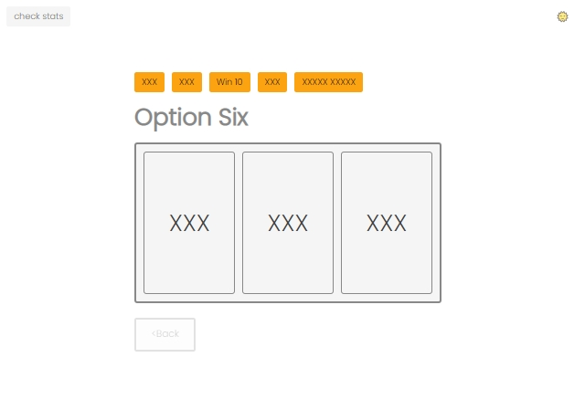

# QUESTIONNAIRE tool

This tool is the fancy submit form for the incoming requests collection for the internal purposes.
The ides is very simple - to answer question one-by-one.
After providing all the answers the summary modal appears, with option to submit data to database.

Night-mode available:

This code is presented for demonstrational purposes and does not include any confidential information.

The project has been separated into two classes - for the form itself ([*/static/script.js*](https://github.com/lukmrv/questionnaire-tool/blob/master/static/script.js)) as well as for the chart ([*/static/stats/charts.js*](https://github.com/lukmrv/questionnaire-tool/blob/master/static/stats/charts.js)). Chart reaches for all the collected data from the database.
